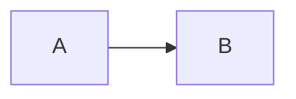
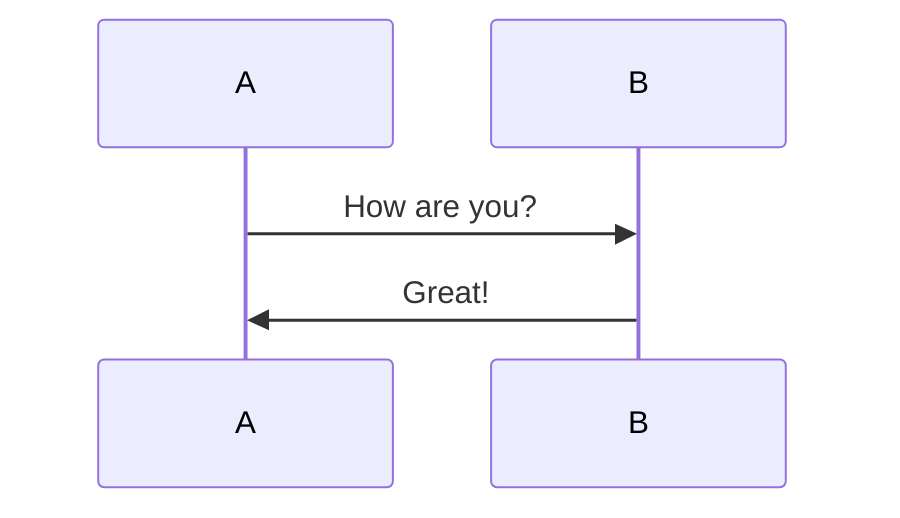

用了博客发现学好markdown可以大幅提升博客编写体验，写项目之类的readme维护也会更方便。

由于本人的md水平比较捉急（

这个md用来放一下简单的语法，忘了可以查


##### 分级标题

    # 一级标题
    ## 二级标题
    ### 三级标题
    #### 四级标题
    ##### 五级标题
    ###### 六级标题  <!--最多6级标题-->


##### 任务列表

```
- [ ] 任务一 未做任务 `- + 空格 + [ ]`
- [x] 任务二 已做任务 `- + 空格 + [x]`
```

效果如下：

* [ ]  任务一 未做任务 `- + 空格 + [ ]`
* [x]  任务二 已做任务`- + 空格 + [x]`
  
  

**斜体、粗体、删除线、下划线、背景高亮**

```
*斜体* 或 _斜体_
**粗体** 或 __粗体__
***加粗斜体***
~~删除线~~
++下划线++
==背景高亮==
```


**流程图**






表格

| 学号  | 姓名  | 序号  |
| --- | --- | --- |
| 小明  | 男   | 5   |
| 小红  | 女   | 79  |
| 小陆  | 男   | 192 |


还有挺多，不过先得换一个好用的md编辑器，不然本地看不见。
